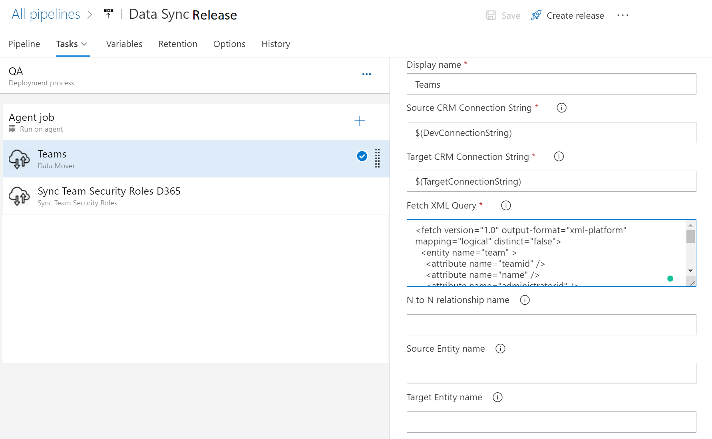

# Dynamics-365-Data-Mover
[[_TOC_]]
Azure DevOps release pipeline task to move configuration data between two Dynamics CRM environments. It also delete option set values from global optionset and local optionset fields.

## Task 1:- Upsert Configuration entity data
This task retrieves the data from source dynamics instace using the fetch xml query. And then upserts the records in the targest dynamics CRM instance.

#### Required input parameters
1. Source Dynamics CRM Connection String
2. Target Dynamics CRM Connection String
3. Fetch XML Query

You can define the above CRM credentials in release pipeline variables and access those variables as shown in the below image.
So that you don't need to re-enter the values for each release stage.

## Task 2:- Removes option set values from the local and global optionset fields.
This task connects to the target Dynamics CRM instance and removes the option values from local optionset fields and global optionset fields.
You can specify more than one local optionset logical name and global optionset logical name using the below format.

#### Input Parameters
1. Attribute Logical Name
    >Specify entitylogicalname "-" attribute logical name. If there are more than one attribute then separate them with "|" symbol.
 
2. Attribute Options To Remove
    >Specify optionset integer value without comma. If you want to remove multiple option values from the same optionset then separate the integer values with ";" symbol.
    >If you've added two attribute names in the first parameter then you need to another optionset integer value separated by "|" symbol.
    >
    >**For Ex:** In the first parameter you've added two local optionset attribute names and would like to remove 2 option values from both of these two attributes. Then you should specify the parameters as shown below.
    >**Attribute logical name:** incident-casetypecode|incident-statuscode
    >**Attribute options to remove :** 100000000;100000001|1000;3
3. Global OptionSet Name
    >Specify the global optionset schema name. If there are more than one global optionset then separate them by "|" symbol.
4. Options To Remove
    >Specify optionset integer value without comma. If you want to remove multiple option values from the same global optionset then separate the integer values with ";" symbol.
    >If you've added two global optionset names in the previous parameter then you need to another optionset integer value separated by "|" symbol.
    >>**For Ex:** In the previous parameter you've added two global optionset names and would like to remove 2 option values from both of these two global optionsets. Then you should specify the parameters as shown below.
    >**Global OptionSet Name:** connectionrole_category|msdyn_feasibility
    >**Options To Remove:** 2;3|192350000
5. Target Dynamics CRM Connection String

